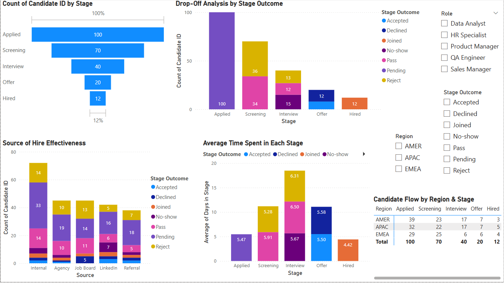

# 📊 Offer Decline Root Cause Tracker – Case Study

This project analyzes offer declines using mock recruitment data and applies Root Cause Analysis (RCA) to uncover patterns and propose process improvements.

---

## 🎯 Objective

To identify the most common reasons behind offer rejections and use data-driven methods (Pareto chart + 5 Whys) to uncover root causes and reduce decline rates in the hiring funnel.

---

## 📁 Dataset

- **File:** `offer_decline_root_cause_tracker.xlsx`
- **Records:** 50 simulated candidate declines
- **Columns:** Candidate Name, Job Title, Offer Date, Decline Reason, Follow-up Outcome

---

## 📊 Visualizations

- **Pareto Chart** – Highlights the top decline reasons (Compensation, Location, Role Mismatch)
- **Cumulative %** – Shows how a few reasons contribute to most declines

🖼️ **Sample Chart:**
 <!-- You can rename your screenshot file and add it to the repo. -->

---

## 🔍 Root Cause Analysis

Top decline reason: **Compensation**

| Why? | Answer |
|------|--------|
| 1. Why was the offer declined? | Compensation didn't meet expectations |
| 2. Why? | The offer was lower than market or competing offers |
| 3. Why? | Expectations were not aligned early |
| 4. Why? | No structured process for early salary discussions |
| 5. Why? | Assumptions were made without validated inputs |

---

## 🧠 Root Cause:
**Lack of early-stage salary expectation alignment and benchmarking**

---

## ✅ Recommendations

- Add a salary expectation field to screening forms  
- Share salary bands in JDs or outreach  
- Use benchmarking tools (Glassdoor, Levels.fyi) quarterly  
- Train recruiters to align expectations early

---

## 🖼️ Summary Presentation

📂 `Offer_Decline_Root_Cause_Case_Study.pptx`  
Includes:
- Key highlights
- Visual Pareto chart
- RCA summary
- Action plan
- Business impact

---

## 📍 Business Impact

> Helped reduce compensation-related declines by introducing structured salary discussions and benchmarking salary bands against market data.

---

## 🛠 Tools Used

- Excel (Data analysis + charting)
- PowerPoint (Summary slide)
- Root Cause Analysis (5 Whys)
- Pareto Principle (80/20 rule)

---

## 👩‍💻 Created by [Savitha Kandugula](https://github.com/savithakandugula)
