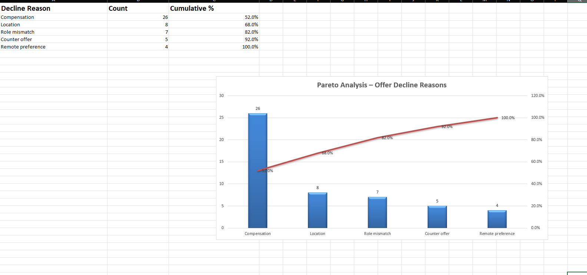

# 📊 Offer Decline Root Cause Tracker – Case Study

This case study analyzes simulated offer declines using Excel and Root Cause Analysis (RCA) techniques to identify the top reasons and propose solutions.

---

## 🎯 Objective

To reduce late-stage offer declines by identifying the most frequent rejection reasons and using data-driven methods (Pareto Chart + 5 Whys) to drive process improvements.

---

## 📁 Dataset

- **File:** `offer_decline_root_cause_tracker.xlsx`
- **Records:** 50 simulated candidate offers
- **Fields:** Candidate Name, Job Title, Offer Date, Decline Reason, Follow-up Outcome

---

## 📊 Visualizations

- **Pareto Chart** – Highlights top decline reasons
- **Cumulative Percentage Line** – Shows how a few reasons account for the majority of drop-offs

🖼️ **Example:**

> 📌 *Compensation alone caused 52% of all offer declines. The top 3 reasons account for over 80% of cases.*

---

## 🔍 Root Cause Analysis – Compensation

Top decline reason identified: **Compensation**

| Why? | Answer |
|------|--------|
| 1. Why was the offer declined? | Compensation didn't meet expectations |
| 2. Why didn’t it meet expectations? | The offer was lower than market or competing offers |
| 3. Why wasn’t that aligned earlier? | Expectations were not discussed early in the process |
| 4. Why weren’t they discussed early? | No structured process for early salary conversations |
| 5. Why is there no structured process? | The current workflow assumes salary ranges are acceptable and doesn’t validate expectations |

---

## 🧠 Root Cause

**Lack of early-stage salary expectation alignment and compensation benchmarking**

---

## ✅ Recommendations

- Add expected salary as a required field during initial screening  
- Share compensation bands proactively in JD or recruiter outreach  
- Conduct quarterly benchmarking using platforms like Glassdoor or Levels.fyi  
- Train recruiters to initiate transparent salary discussions upfront

---

## 📂 Deliverables

- `offer_decline_root_cause_tracker.xlsx` – Excel dataset with charts  
- `Offer_Decline_Root_Cause_Case_Study.pptx` – Summary slide with RCA and recommendations  
- `pareto_offer_declines.png` – Visualization used in README  

---

## 💡 Business Impact

> Helped reduce compensation-related offer declines by introducing early expectation alignment and market benchmarking.

---

## 🛠 Tools Used

- Microsoft Excel (formulas, charting)
- Root Cause Analysis (5 Whys)
- Pareto Principle (80/20 rule)
- PowerPoint (summary visualization)

---

## 👩‍💻 Created by [Savitha Kandugula](https://github.com/savithakandugula)

